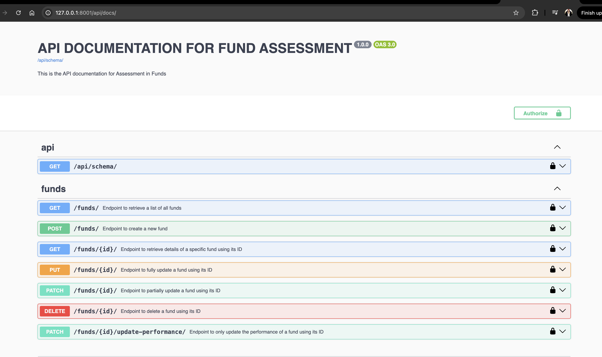
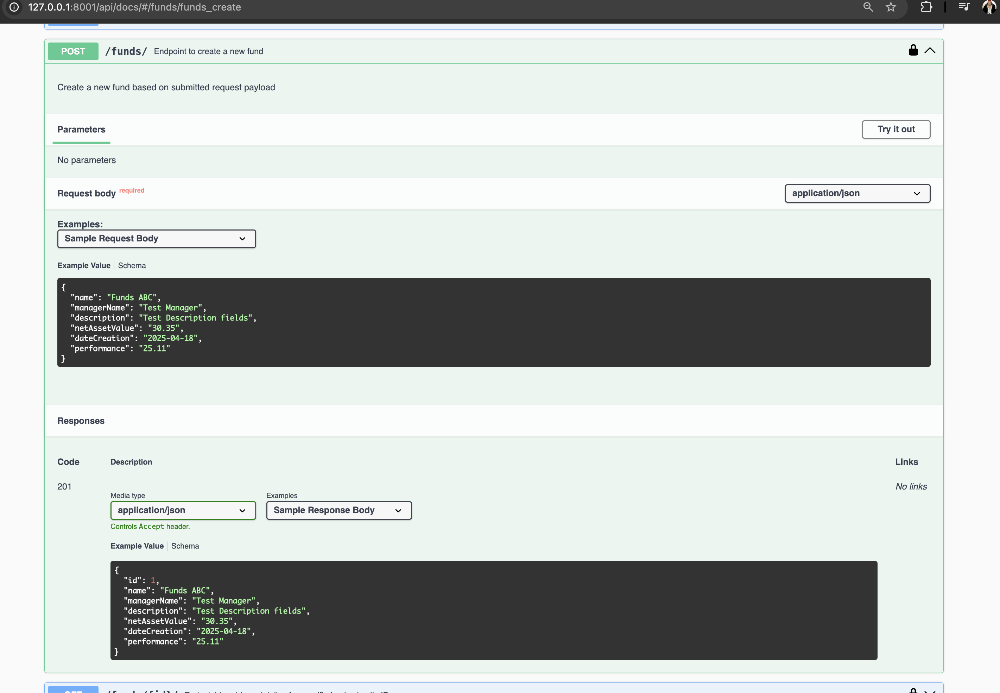
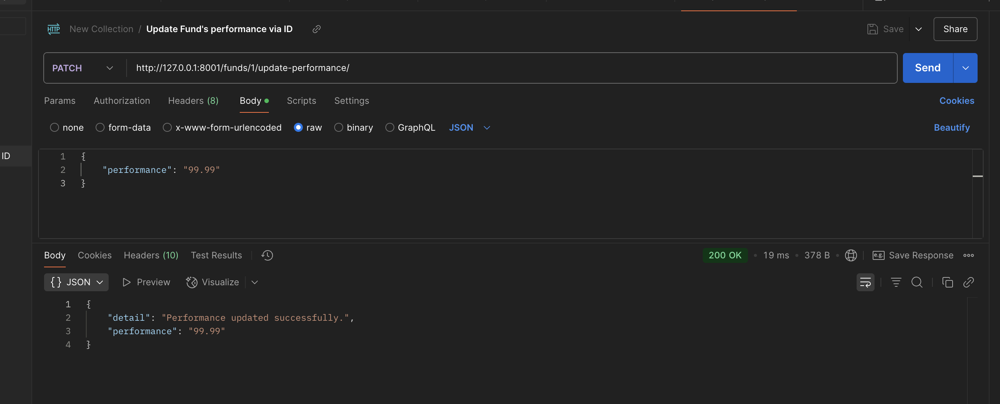

# Assignment for Funds management
[](https://github.com/VivaainNg/assignment/actions/workflows/django-ci.yaml)
[](https://github.com/ambv/black)


---

## Basic Requirements

- Python: 3.12.2
- Django: 5.2


### Installing

A step by step guide on how to setup your local Python environment for this project.


1: Create a local Python venv(virtualenv) based on your environment's name `<envName>`:

```
$ python3 -m venv <envName>
```

2: Activate the `<envName>` virtual environment that you've just created from step above:

```
# On Windows (Command Prompt):
> <envName>\Scripts\activate

# On Windows (Powershell):
> .\<envName>\Scripts\Activate.ps1

# On Unix (Linux/macOS):
$ source <envName>/bin/activate
```

3: Install all the modules listed within requirements.txt in this repo:

```
$ pip install -r requirements.txt
```

4. (Optional) `cd` into root directory of **assignment** and make `manage.py` file executable by:

```
$ chmod +x manage.py
```

5: To run the Django server at localhost:

```
$ ./manage.py runserver
```

6: Sync database based on latest DB's migration files (courtesy of Django's out-of-the-box ORM):

```
$ ./manage.py migrate
```

---


## API Documentations

- To view documentations for list of possible endpoints, you can head over to main OpenAPI/Swagger documentation page at [http://127.0.0.1:8000/api/docs/](http://127.0.0.1:8000/api/docs/):


- Figure below shows a sample of `creating new Fund via the endpoint` shown below, along with sample request & response payload:



- You can also directly test the endpoints by clicking the `Try it out` button as shown in each endpoints and modify the request payload or path params in the URL.

- Alternatively, you can also test these endpoints using `curl` on terminal, or using tools like Postman, as shown here, by updating the performance of a Fund:


---

## Running Tests


1: To simply run a simple overall test:

```
$ python manage.py test
```

2: (Optional) Using Github, every single commit being pushed to main branch will trigger Github Actions to perform basic Python setups, dependencies installations as well as running tests. History of entire actions being triggered can be viewed at [here](https://github.com/VivaainNg/assignment/actions)
